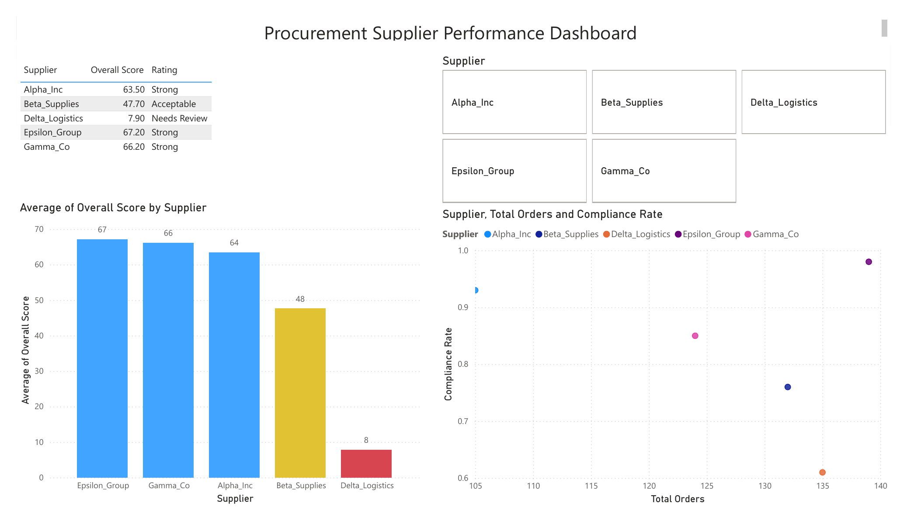

# Procurement Supplier Performance Scorecard

Weighted KPI analysis of 635 purchase orders across 5 suppliers, identifying 
which suppliers  the greatest compliance and cost risk.

## Problem
Evaluate supplier performance across lead time, defect rate, cost savings, 
and contract compliance to identify which suppliers carry the most risk to 
the supply chain.

## Method
- Cleaned raw PO data and documented data quality issues with reasoning 
  (see `Data Issues Log` tab)
- Normalized each KPI to a 0-100 scale (min-max normalization)
- Combined into a weighted score: Compliance 35%, Cost Saving 30%, 
  Lead Time 20%, Defect Rate 15%
- Built a Power BI dashboard replicating the scorecard

## Key Finding
**Delta_Logistics ranks last overall (7.9/100)** despite being the 2nd-highest 
volume supplier (135 orders) — driven by the lowest compliance rate (60.7%) 
in the supplier pool. This is the highest-risk volume/performance combination 
in the portfolio.

## Recommendation
Place Delta_Logistics on a 90-day compliance improvement plan ahead of 
contract renewal.

## Power BI Dashboard

Interactive one-page dashboard replicating the Excel scorecard, with a 
supplier slicer for filtering.

## Files
- `Procurement_KPI_Analysis_Dataset.xlsx` — full analysis: cleaned data, KPI 
  definitions, data issues log, supplier scorecard with charts, key findings
- `dashboard_preview.png` — Power BI dashboard export

## Tools
Excel (data cleaning, weighted scoring, charts) · Power BI (interactive dashboard)
